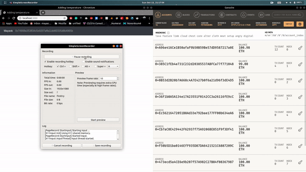

# Basic Blockchian App

This is the app that I made at the end of my summer research internship at UIET, Chandigarh.

I used HTML and CSS for making the frontend and used the truffle suite for making the blockchain backend.
Web3JS, a JavaScript libaray is used to make the web app interact with the blockchian. 

This blockchian app takes a string entered by the user and stores it on the local blockchian(Ganche). 
The browser interacts with the blockchain witht he help of Metamask.
Then the string is retrived and shown on the webpage.

Here, I input the string "14th Temperature" in the text box. After pressing Enter,the metamask notification appears asking to confirm the transaction. After confirmation, the gas utilised to put the data on blockchian is reduced from the account.

My original idea was to put files on blockchian(technically their hash because putting actual data on blockchain takes a lot of gas) and store the file on the IPFS(InterPlanetary File System). 
